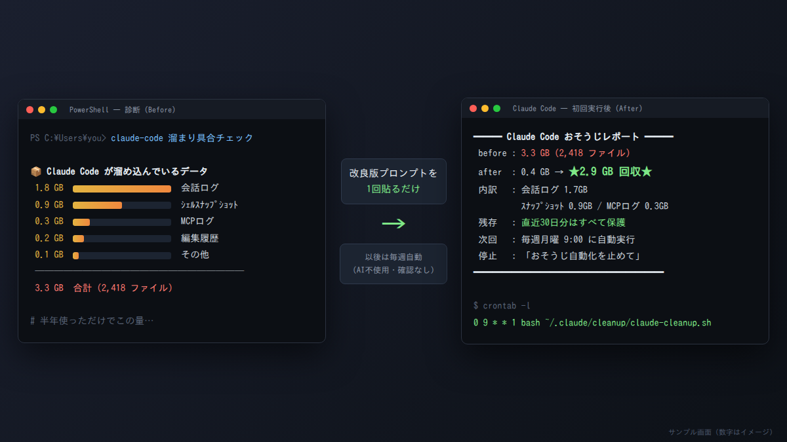

# Claude Code 週次おそうじ（claude-cache-cleanup）

**海外でバズった「codex に後片付けを任せる」Tip の改良版。プロンプト1枚で導入できます。**

Claude Code は使うほどローカルにデータが溜まります（会話ログ、シェルスナップショット、編集履歴、MCPログ、一時ファイル）。
これを **「安全な範囲だけ・週1回・以後は確認なし」** で自動的に片付ける仕組みを、プロンプトを1回貼るだけでセットアップします。

**→ コピペ用プロンプトはこちら: [PROMPT.md](./PROMPT.md)**



## 元ネタと、何を改良したか

元ネタ（codex 版）は「古いキャッシュを消す週次自動化を設定して。毎回聞かずに毎週やって」という一文プロンプトでした。発想は最高ですが、そのまま真似ると **何をどう消すかがその場のAI任せ** になります。改良版は次の4点を作り替えています。

| 観点 | codex 原版 | 改良版 |
|---|---|---|
| 毎週の実行 | AIが毎週起動して判断 | **AIを使わない。** 決定的スクリプト＋OS標準スケジューラ（タスクスケジューラ / launchd / cron）。トークン消費ゼロ・許可プロンプトゼロ |
| 安全の保証 | 「安全に」をAIが解釈 | **消してよい場所を実パスで列挙**（allowlist）。30日より新しいものはフィルタで機械的に除外。設定・スキル・認証情報・プロジェクトメモリは構造的に対象外。保持7日未満は拒否 |
| 見える化 | なし | 実行前に**ドライランの表**、初回実行後に**Before/After レシート**、毎週の結果は cleanup.log に記録 |
| やめ方 | 言及なし | レポートに停止方法を明記。「おそうじ自動化を止めて」の一言で解除 |

## ビフォーアフター画像の作り方（X投稿用）

1. **Before**: [PROMPT.md](./PROMPT.md) 冒頭の「溜まり具合チェック」ワンライナーを実行してスクショ
2. 本体プロンプトを貼って実行
3. **After**: 最後に出る「おそうじレポート」をスクショ

読者も同じワンライナーで自分の溜まり具合を確認できるので、投稿への参加導線になります。
イメージ画像を自作したい場合は [assets/before-after-mock.html](./assets/before-after-mock.html) の数字を書き換えてブラウザで開けば、上のサンプル画像と同じ見た目を再現できます。

## 再現性の担保

- 本体プロンプトは、**スキル等を一切入れていない素のエージェントに渡して隔離環境で実地テスト**し、「古いものだけ消える・保護対象が残る・スケジューラ登録・レシート出力」まで再現されることを確認しています
- 掃除対象のパスと Claude Code 組み込みの保持設定 `cleanupPeriodDays`（既定30日・起動時実行）は公式ドキュメントで確認済み。プロンプトはこの設定も同じ日数に揃えます
- [scripts/](./scripts/) に検証済みの参考実装を同梱（bash 版はテストハーネスで削除対象・保護対象・非破壊ドライランを検証済み）。プロンプトだけで組み上がるスクリプトの「正解例」として使えます

## スキル版として入れる場合（おまけ）

チームで配る・繰り返し運用するなら、スキルとしても導入できます:

```bash
npx skills add Ted0321/kotetsu-work-ai-skills@claude-cache-cleanup
```

導入後は「Claude Code の古いキャッシュを週次で掃除して」のような自然な依頼で発火し、設置後の運用（「掃除の結果見せて」「今すぐ掃除して」「止めて」）も安定してハンドリングされます。

## FAQ

**Q. Claude Code には `cleanupPeriodDays`（既定30日）があるのに、なぜ要るの？**
組み込みの掃除は Claude Code の**起動時**に走り、対象も限定的です。ターミナルを開きっぱなしの人、MCPログ・一時フォルダ・古い編集履歴まで含めて片付けたい人向けに、OSスケジューラで確実に週1回実行し、回収量のログも残します。

**Q. 本当に安全？**
「新しいものに触らない」をAIの注意力ではなく**更新日時フィルタ**で保証し、「消してよい場所」を**allowlist**で固定しています。さらに保持7日未満は拒否、設置前ドライラン必須、実行ログ付きです。

**Q. 止めたいときは？**
Claude Code に「おそうじ自動化を止めて」と言えば解除されます（手動なら Windows: `Unregister-ScheduledTask -TaskName ClaudeCodeCleanup`、macOS: `launchctl unload -w ~/Library/LaunchAgents/com.claude-code.cleanup.plist`、Linux: `crontab -e` で該当行を削除）。

**Q. 会社PCと自宅PCの両方で使いたい**
データはマシンごとに溜まるので、各マシンで一度ずつプロンプトを貼ってください。

## 注意

- ユーザーの**ローカルマシンの Claude Code** で実行してください（クラウド版セッション内で実行しても意味がありません）
- 削除されたデータは復元できません。会話ログを消すと `claude --resume` でその会話に戻れなくなります（30日より古いものだけ）。過去の会話をよく掘り返す人は保持日数を60〜90日に

## クレジット

海外で共有されていた codex の週次クリーンアップTipを、Claude Code のデータ配置・権限モデルに合わせて再設計したものです。

想定セッション例: [examples/sample_input_output.md](./examples/sample_input_output.md)
